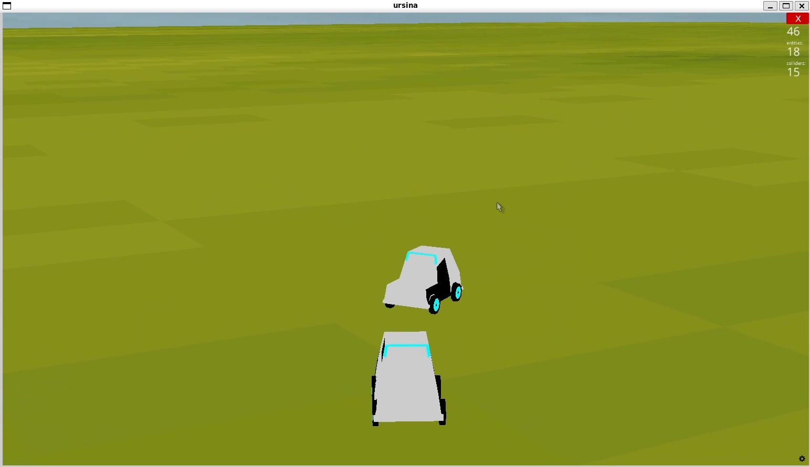

# Goofy-Racers

Hello this is a 3D game I made using [Ursina](https://www.ursinaengine.org/) and [Ursina Networking](https://github.com/kstzl/UrsinaNetworking/tree/main)

Complete Features:
<ul>
<li>basic Multiplayer networking</li>
<li>Controls for driving but with occasional bugs</li>
<li>basic UI</li>
</ul>

Features currently in development:
<ul>
<li>Stable Multiplayer</li>
<li> Lap System with checkpoints</li>
<li>better UI</li>
</ul>

Car Model: 3D Low Poly Car model by [Ceasaryo](https://www.turbosquid.com/3d-models/3d-low-poly-car-model-1933572)

Track Model: Mario V